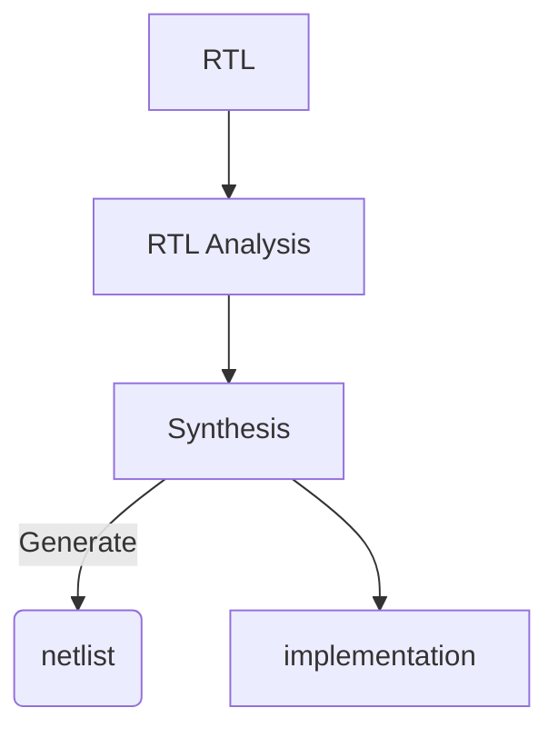

## 목차
- [Vivado 툴 사용법](#vivado-툴-사용법)
  - [Vivado interface 설명](#vivado-interface-설명)
  - [Flow navigator](#flow-navigator)
  - [Constraints 파일(.xdc)](#constraints-파일xdc)
- [Verilog 문법](#verilog-문법)
  - [Instance](#instance)
    - [Instantiation 방법](#instantiation-방법)

# Vivado 툴 사용법
## Vivado interface 설명


- t: transiver = transfer + reciever
  - 차동증폭으로 디지털 신호를 주고 받음
> 차동증폭: 데이터를 1, 0 정확히 보내는 것이 아닌, 전압의 폭으로 1, 0을 정함


- 가급적 폴더 생성 시 체크해두는 것이 좋다
## Flow navigator

- 반도체 설계 개발 Flow와 동일(유사)
## Constraints 파일(.xdc)
- 생성된 회로를 FPGA 핀에 Mapping해줌
- LVCMOS
  - Low Voltage CMOS: 저전압으로 CMOS Control
  - REF) LVTTL: 5V 지원
- REF) Termination: 신호가 반사되어 돌아옴 --> CMOS는 발생할 일 거의 없음

# Verilog 문법
## Instance
- C언어의 함수 
    - 함수가 메인 함수 내에 정의되면, 해당 함수를 수행하고 돌아옴
- Verilog의 instance
    - Verilog의 instance는 물리적으로 실제 배치됨
    - 수행하러 갔다가 돌아오는 개념이 아님
    - 물리적으로 고정되어 동작

### Instantiation 방법
1) Ordered Port List
- Module의 포트 정의 순서대로 instance 생성
```verilog
  module adder(input a, input b, output c);
    assign c = a + b;
  endmodule

  module TOP(input a, input b, input c);
    adder ADD0 (a,b,c);
  endmodule
```
- 별로 추천하지는 않음
  - 실수할 가능성이 큼
2) Named Port List
- Instance 선언 시 포트 이름으로 정의
```verilog
  module adder(input a, input b, output c);
    assign c = a + b;
  endmodule

  module TOP(input a, input b, input c);
    adder ADD0 (.a(a),.b(b),.c(c));
  endmodule
```
- ⭐매우 추천하는 방법
  - 실수할 가능성이 매우 적음
- 실무에서도 이렇게 정의함
