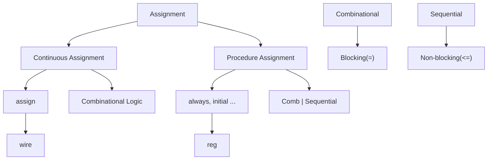

## 목차
- [\[이론\]](#이론)
- [Gate 수준 모델링](#gate-수준-모델링)
	- [High-Z](#high-z)
		- [bufif0, bufif1](#bufif0-bufif1)
	- [Buffer](#buffer)
- [Assignment](#assignment)
	- [Continuous Assignment](#continuous-assignment)
	- [Procedure Assignment](#procedure-assignment)
	- [force-release](#force-release)
- [\[실습\]](#실습)
	- [Sequential Circuit](#sequential-circuit)
		- [Latch \& F/F](#latch--ff)
			- [Latch Vs F/F](#latch-vs-ff)
		- [Latch Schematic](#latch-schematic)
		- [D F/F Schematic](#d-ff-schematic)
		- [\[Summary\]](#summary)
	- [⭐⭐⭐Propagation Delay](#propagation-delay)
		- [Meta stable](#meta-stable)
		- [Propagation Delay (== Gate delay)](#propagation-delay--gate-delay)
		- [Setup time](#setup-time)
		- [Hold time](#hold-time)
		- [⭐CDC(Clock Domain Cross) 구간](#cdcclock-domain-cross-구간)
			- [Solution 1) ⭐Synchronizer Circuit](#solution-1-synchronizer-circuit)
			- [Solution 2) FIFO 사용](#solution-2-fifo-사용)

# [이론]

# Gate 수준 모델링

## High-Z
- Z: Impedance
  - 교류 저항 성분
  - 교류 뿐만 아니라 직류도 차단하는 용도
- 그래서 3상을 High-R이 아닌 High-Z로 표현

### bufif0, bufif1
1) bufif0

|  sel  |  out  |
| :---: | :---: |
|   0   | pass  |
|   1   |   Z   |

2) bufif1

|  sel  |  out  |
| :---: | :---: |
|   0   |   Z   |
|   1   | Pass  |
> wire로 구현가능하기 때문에 설계에 잘 사용 안 함
> > 소자 수준 모델링할 때 이용 
> > 설계에서는 2x1 MUX를 사용

[권장 방법]
- assign (condition) ? output : Z;
  - 이런식으로 assign으로 Tri state Buffer 구현을 권장

## Buffer
- 전류 증폭(== 신호 복원 == Drive strength)
- Delay 맞출 때(ex) Propagation delay)
# Assignment

## Continuous Assignment
- 할당문의 순서가 Simulation이나 합성에 영향을 주지않음
  - 물리적으로 배치되므로, 동시에 수행
- l_value에 net type

## Procedure Assignment
- 할당문의 순서가 동작에 영향을 줌 (begin-end)
- l_value에 reg type

## force-release
- 값을 강제로 덮어씀
- 근데 이거보단 Tri-state Buffer를 쓰는 것을 권장

# [실습]

## Sequential Circuit
- Clock 신호의 Edge에 동기되어 동작(Transition)하는 회로
  - Edge가 아닐 때는 저장 혹은 동작

### Latch & F/F
- D F/F = 2개의 D-Latch
#### Latch Vs F/F
|      Latch      |     F/F      |
| :-------------: | :----------: |
| Level-sensitive | Edge trigger |

### Latch Schematic
1) SR Latch 

> NAND S-R Latch: S = 0, R = 0 --> Race condition & 보수 오류 
> NOR S-R Latch: S = 1, R = 1 --> Race condition & 보수 오류 
>> 이런 Case가 있기 때문에 Latch를 발생시키면 안된다 
>> ⭐⭐⭐Error Case --> 유지 Case로 돌아올 때, 값이 발진하는 문제가 생김

2) D Latch 
 

|   E   |   D   |   Q   |
| :---: | :---: | :---: |
|   0   |   0   | Keep  |
|   0   |   1   | Keep  |
|   1   |   0   | Reset |
|   1   |   1   |  Set  |

- ⭐값을 저장하지 못하는 문제 존재

### D F/F Schematic
 
> Positive Edge Trigger 방식
- 2개의 D-Latch로 구현

### [Summary]
1. RS Latch(NOR): RS = 2'b11 --> 2'b00
	- 발진하는 문제
2. D Latch(⭐5 Gates)
	- RS Latch에 Gate 추가
	- Level Sensitive하게 동작
	- 조합논리에서 값을 저장하거나 유지할 때 사용(모든 case가 정의안된 경우)
    	- **근데 지양하자**
3. D F/F(⭐11 Gates)
	- 2개의 D-Latch 사용
	- Latch의 Gate에 clk을 invert하여 각각 반전 시켜 넣어줌
	- Edge Trigger 방식으로 동작
> Latch 문제점
> > 1. 원치않는 동작(Noise)
> > 2. 타이밍 문제

> D F/F의 장점
> > 입력의 Noise를 제거가능 
> > 대신 게이트 수가 많아 Power와 Area에서 손해(**+ 발열**)

## ⭐⭐⭐Propagation Delay
### Meta stable
- Clk의 edge와 동시에 D(입력)가 바뀜
- 출력이 뭐가 나올지 모름
- 입력이 Edge 전에 들어오게 보장해야 함 --> Setup time

### Propagation Delay (== Gate delay)
- 소자의 물리적 특성에 의해 발생하는 Delay
  - 입력과 동시에 출력이 나오지 않는다
- 입력에 대해 안정적인 출력이 나오기까지의 시간

### Setup time
- 안정적인 출력을 위해, clk의 **엣지 전**에 입력값을 유지해야하는 **최소시간**
- 
### Hold time
- 안정적인 출력을 위해, clk의 **엣지 후**에 입력값을 유지해야하는 **최소시간**

### ⭐CDC(Clock Domain Cross) 구간
- 서로 다른 클럭을 사용하는 시스템에서 통신 시, Meta stable이 발생할 수 있는 구간

#### Solution 1) ⭐Synchronizer Circuit

- 동기식 Synchronizer: 동일한 Clk source 사용
  - 이 방식을 많이 사용한다
- 비동기식 Synchronize: 다른 Clk source 사용

#### Solution 2) FIFO 사용

