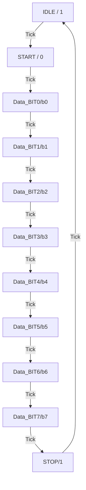

## 목차
- [UART(Universal Asynchronous Receiver Traceiver)](#uartuniversal-asynchronous-receiver-traceiver)
	- [Serial 통신 Vs Parallel 통신](#serial-통신-vs-parallel-통신)
		- [Serial 통신](#serial-통신)
		- [Parallel 통신](#parallel-통신)
	- [Asynchronization 통신](#asynchronization-통신)
	- [UART 통신](#uart-통신)
		- [Uart 통신 protocol](#uart-통신-protocol)
		- [Parit bis](#parit-bis)
		- [Baud rate](#baud-rate)
		- [UART TX FSM](#uart-tx-fsm)
		- [ASM(Algorihmic State Machine)](#asmalgorihmic-state-machine)

# UART(Universal Asynchronous Receiver Traceiver)
## Serial 통신 Vs Parallel 통신
|   NuLL   | Serial | Parallel |
| :------: | :----: | :------: |
|   속도   |  느림  |   빠름   |
|  line수  |  적음  |   많음   |
| 통신거리 |   긺   |   짧음   |
> Parallel은 선간 노이즈에 의해 장거리 통신이 어렵다

### Serial 통신
- 통신 모드
  - Uart
  - SPI
  - I2C
  - USB
  - Ethernet
- Serial Communication mode
  - simplex: 단방향
  - half-duplex: 양방향(무전기)
  - full-duplex: 양방향(전화기)
    - 권장: 병목, 간섭 없음

### Parallel 통신
- Bus
- I/O Bus

## Asynchronization 통신
- 0이나 1의 **유지시간**으로 값(0,1)을 인식함
  - clk이 없으니 프로토콜이 필요

## UART 통신
- 사용처
  - Debugging
  - 장비 간 통신
- 구조

- GND의 역할
  - 기준 전압을 맞춰줌
  - 동일한 조건에서 동작하기 위함
    - 기기간의 기준전압을 맞춰줌
- Protocol
  - 기계간 통신을 위한 규칙
### Uart 통신 protocol
- 기본(Idle)은 High
- 통신을 시작하면 Start bit(=0)을 1비트 구간만큼 내보냄
- LSB first
- 데이터 전송을 끝내면 stop bit(=1)를 비트 구간만큼 띄움
- Parity bit를 포함시켜 보내는 경우도 존재
> Auto negotiation
> > 자동으로 protocol을 맞추어줌
> >> Uart는 Non-auto negotiation

### Parit bis
- Even parity
  - 1의 개수가 짝수
  - Parity bit를 포함해서 1의 개수가 짝수
  - 입력 bit들을 XOR
- Odd parity
  - 1의 개수가 홀수
  - Parity bit를 포함해서 1의 개수가 홀수
  - 입력 bit들을 XNOR
> Serial 통신 앱
> > HW 개발: comport master가 좋음 
> > SW 개발: teraterm, putty 용이

### Baud rate
- 초당 보낼 수 있는 Symbol의 수
- Uart에서는 bps와 유의어로 사용
  - 초당 보낼수 있는 비트수
  - stop, start, parity bit 포함

### UART TX FSM

> Time: Tick gen
> > Tick 간격: Baud rate
>>> Receiver 쪽 Tick 주기가 더 짧다
### ASM(Algorihmic State Machine)
> 순서도
>> 클럭마다 수행할 동작
>>> FSM을 먼저 만들고 ASM 만듦

- ASM 차트 구성요소
  - State Box
  - Decistion Box
    - 분기
  - Conditional Output Box
  - 
