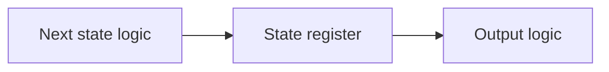

## 목차
- [Behavioral Modeling](#behavioral-modeling)
	- [reg type](#reg-type)
	- [Blocking Vs Non-Blocking](#blocking-vs-non-blocking)
		- [Blocking](#blocking)
		- [Non-blocking](#non-blocking)
	- [⭐if-case문](#if-case문)
		- [⭐Latch Problem](#latch-problem)
		- [if-if는 지양하자](#if-if는-지양하자)
		- [우선순위](#우선순위)
		- [if Vs case](#if-vs-case)
	- [반복문](#반복문)
		- [forever](#forever)
		- [while문](#while문)
		- [repeat(반복횟수)](#repeat반복횟수)
		- [⭐Loop와 차이(합성에서)](#loop와-차이합성에서)
	- [Procedure assignment: 타이밍 제어(SIM)](#procedure-assignment-타이밍-제어sim)
		- [#시간](#시간)
- [FSM](#fsm)
	- [Moore Vs Mealy](#moore-vs-mealy)

# Behavioral Modeling
## reg type
- reg 변수의 default값은 **X**이다

## Blocking Vs Non-Blocking
### Blocking
- C언어와 유사
- 바로 대입

### Non-blocking
- begin-end가 끝나기 전까지 변수들의 변화를 Time-table에 업데이트
- 업데이트가 끝난 후에 값을 대입
> 2개를 섞어 사용하지 마라

## ⭐if-case문
### ⭐Latch Problem
- 모든 case를 정의해주지 않거나 else를 정의하지 않으면 Latch 발생가능

### if-if는 지양하자
```verilog
	always @(*) begin
		if() begin
			if()
		end
	end
```
- if: 물리적으로 MUX 발생
- Delay가 증가함
- **순차논리**와 같이 사용시 문제가 발생할 수 있음
  - 타이밍 문제 발생

### 우선순위
- Case문
  - case문은 우선순위가 없다
- if문
  - if문은 조건에 우선순위가 있다

### if Vs case
- case문은 값의 범위가 조건이 될 수 없다
  - 값의 범위 혹은, 비교 등의 조건은 if문을 이용한다

## 반복문
> 주로 시뮬레이션에서 사용한다<br>
> 반복 횟수가 정해져야 합성 가능하다
### forever
- 합성을 지원하지 않음

### while문
- 반복 횟수가 지정되지 않으면 합성되지 않음

### repeat(반복횟수)
- for문과 달리 index를 지정할 수 없다

### ⭐Loop와 차이(합성에서)
- LOOP는 계속해서 반복함
- 합성에서 반복문은 instance를 정해진 횟수만큼 생성함

## Procedure assignment: 타이밍 제어(SIM)
### #시간
- begin-end문안에서 #시간은 누적 시간이다
  - begin-end 순차 실행
- fork-join에서는 #시행은 그 시간 타이밍이다
  - fork-join은 동시(병렬) 수행
    - begin-end의 non block으로도 사용가능
  - 주로 테스트벤치에서 많이 사용
> ⭐fork-join은 회로 합성되지 않음

# FSM
## Moore Vs Mealy
- state가 4개 이하면 큰 차이없다
- 동일한 FSM에 대해 
  - Moore는 Mealy에 비해 상태가 1개 더 생기는 경우가 발생한다
- Mealy는 조합논리에 의해 Moore에 비해 출력변화가 빠르다
- Moore의 출력은 항상 clk에 동기된다
  - state에 동기되기 때문
- 2개 중에 뭐가 더 낫다는 없다
  - 큰 차이 없다
  - 두개 섞어 사용해도 된다
  - 결과가 잘 나오기만 하면 됨
 
## FSM 회로 구성

- Next state logic & Output Logic: Combinational Logic
- State register: Sequential Logic
