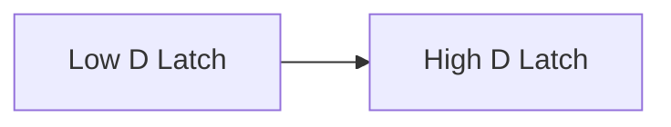
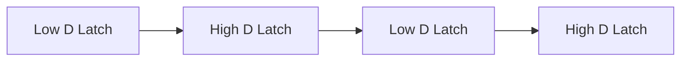

## 목차
- [Combinational Logic](#combinational-logic)
	- [합성되지 않는 경우](#합성되지-않는-경우)
	- [always문 유의사항](#always문-유의사항)
		- [Event list](#event-list)
		- [if-case](#if-case)
		- [⭐⭐⭐Case문 Latch 예방](#case문-latch-예방)
		- [for, generate문](#for-generate문)
	- [Look Up Table](#look-up-table)
	- [MUX](#mux)
	- [Encoder와 Decoder](#encoder와-decoder)
		- [Encoder(압축, 암호화)](#encoder압축-암호화)
		- [Decoder(복호화)](#decoder복호화)
	- [⭐3 State Bus Driver](#3-state-bus-driver)
- [Sequential Logic](#sequential-logic)
	- [⭐D F/F](#d-ff)
	- [⭐Shift register](#shift-register)
	- [Blocking \& Non-blocking](#blocking--non-blocking)
	- [Sequential logic \& Combinational Logic](#sequential-logic--combinational-logic)
	- [동기식 리셋](#동기식-리셋)
	- [⭐⭐⭐Shift register](#shift-register-1)
		- [LFSR(Linear Feedback Shift Register)](#lfsrlinear-feedback-shift-register)


# Combinational Logic
## 합성되지 않는 경우
- initial문
- 반복횟수가 확정이 아닌 반복문
- fork-join문
- 타이밍 제어문

## always문 유의사항
### Event list
- event list 목록에 입력 신호들이 빠짐없이 포함되어야함
  - *를 쓰는 것이 편함

### if-case
- 모든 case들을 정의하지 않으면 Latch 발생 가능성

1. if-if

2. if-else

> assign문으로 하는게 latch가 발생가능성이 낮음
> > 근데 꼭 assign을 위주로 사용하려고 하진 말자
> >> 골고루 쓰임

### ⭐⭐⭐Case문 Latch 예방
> Latch
> > 원치않는 동작 + 멈춤현상
- default문 사용하기
- 초기화하기
- 모든 경우의 수 정의
```verilog
	// default
	always @(*)begin
		case(sel) begin


		default: ;
		end
	end

	//초기화
	always @(*)begin
		//초기화 구문
		a = 0;
		case(sel) begin
		2'b00 : a = 3'b111;

		default: ;
		end
	end

	//모든 case
	always @(*)begin
		case(sel) begin
		2'b00 : a = 3'd0;
		2'b01 : a = 3'd1;
		2'b10 : a = 3'd2;
		2'b11 : a = 3'd3;
		end
	end
```

### for, generate문
- integer, genvar는 반복문 밖에서 정의해줘야 함
  - 안그러면 에러남
```verilog
	//for문
	integer i;
	always @(*) begin
		for(i = 0;~;~) begin

		end
	end

	//generate문
	genvar j;

	generate
		for(j = 0;~;~) begin

		end
	endgenerate
```
## Look Up Table
- case문을 이용해 정의
  - ex) bcd controller
- pros) 연산을 미리 해두어 계산이 빠름
- cons) 메모리 소모가 발생

## MUX
- 여러 입력 중 하나만을 선택해 출력
  - 2^n input --> n bit select signal
- 보통 입력과 출력의 비트폭이 동일하다
> DeMUX
> > 하나의 입력으로 여러개의 출력

## Encoder와 Decoder
### Encoder(압축, 암호화)
- 여러개의 입력을 적은 개수 출력

### Decoder(복호화)
- 적은 개수 입력을 여러개 출력

> Synthesis
> > Code(Schematic)을 Netlist(물리)로 바꿈

## ⭐3 State Bus Driver
- Bus의 sel이 같은 값을 가지면 안됨
  - Multiple driven error발생
- Not gate를 추가해 다른 값이 들어가게 해줌
- 입력 쪽은 MUX를 쓰기도 함
  - 2x1 MUX로 쓸때 한쪽은 Data, 한쪽은 Floating시킴
- 임베디드에서 I/O port에서 어떤 포트로 사용할지 정할 때 자주 사용

# Sequential Logic
## ⭐D F/F


## ⭐Shift register

> ❗모듈 내에서는 같은 edge를 사용하는 것을 권장함

## Blocking & Non-blocking
> 섞어쓰지마라❗

- Blocking
  - ⭐순차회로에서 Blocking쓰면 조합 논리가 길어져 원치않는 동작발생 가능성
  - Continuous문에서만 blocking을 쓰자
- Non-Blocking
  - 순차회로에서 사용 권장

## Sequential logic & Combinational Logic
- ⭐가능하다면 Sequential logic안에 조합논리를 기술하기보다 조합 논리는 밖으로 빼는게 좋다
```verilog
	tmp = a & b;

	always @(posedge clk or posedge rst) begin
		if(rst) begin
			qout <= 1'b0;
		end
		else ebgin
			qout <= tmp;
		end
	end
```

## 동기식 리셋
- ❗리셋의 주기가 클럭의 주기보다 반드시 길어야 한다❗
> FPGA는 동기식 리셋이 잘 쓰임
> > ASIC은 동기식 Set, 비동기식 Reset이 자주 쓰임

## ⭐⭐⭐Shift register
- SISO
  - Metastable 제거
    - Synchronizer
- SIPO
  - Debounce 회로
  - I/O RX
- PISO
  - 입력이 Mux로 묶임
  - I/O TX
- PIPO
  - BUS 레지스터
  - MUX로 입력이 묶여 load에 따라 동작을 바꿀 수 있다
    - load = 0: Shift Register(SIPO)
    - load = 1: PIPO

### LFSR(Linear Feedback Shift Register)

- N bit shift reg에 의해 최대 2^n개의 난수 발생
- Shift Register + XOR gate
- 용도
  - pseudo random-sequence 발생
  - 데이터 압축
  - 데이터 무결성 검사
    - 블록별 중요한 F/F들을 연결
    - BIST(Buit in self Test)회로에 사용
      - 테스트 벡터 생성에 사용됨
      - 칩마다 BIST가 들어감
      - Layout 엔지니어가 보통 설계함

